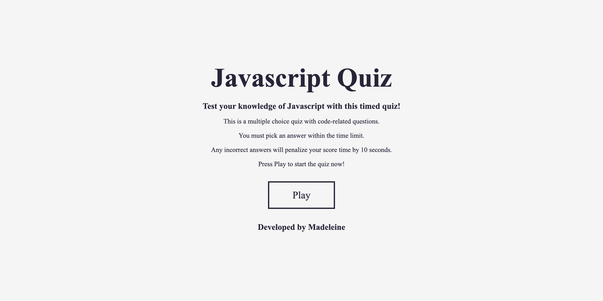
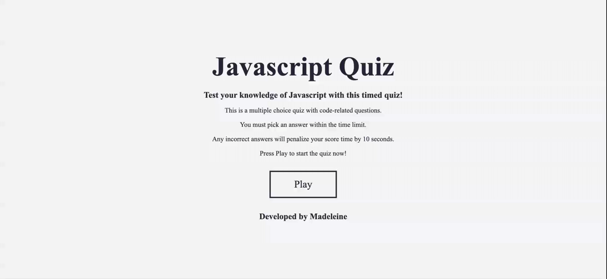

# CODE QUIZ

## Description
This week I have been tasked to build a timed Javascript quiz with multiple choice questions/answers that will run in any browser while also being responsive. 

## User Story
AS A coding boot camp student
I WANT to take a timed quiz on JavaScript fundamentals that stores high scores
SO THAT I can gauge my progress compared to my peers

## Criteria
GIVEN I am taking a code quiz
WHEN I click the start button
THEN a timer starts and I am presented with a question
WHEN I answer a question
THEN I am presented with another question
WHEN I answer a question incorrectly
THEN time is subtracted from the clock
WHEN all questions are answered or the timer reaches 0
THEN the game is over
WHEN the game is over
THEN I can save my initials and my score

## Code Quiz
Below is a brief video showing my quiz in action. 
As soon as the user presses play, it will open the main quiz page were they will be greeted with a countdown timer and their first mutliple choice question to answer. If they answer the question correctly, their choice will highlight green. If they answer wrong, their choice will highlight red. After 5 questions, the quiz will end and go to the end page where their score will show. The user can choose whether they would like to save their score and username or start the quiz again. 

## Final Comments
This homework was quite a challenge and I still have a few things I need to modify and add to:

* the timer needs to be able to substract 10s for every wrong answer.
* the timer needs to stop at 0 and move to end page.
* the final timer number needs to show as the final score.
